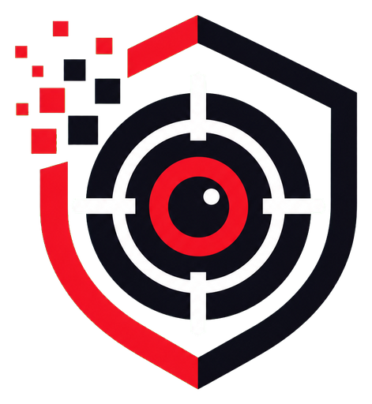
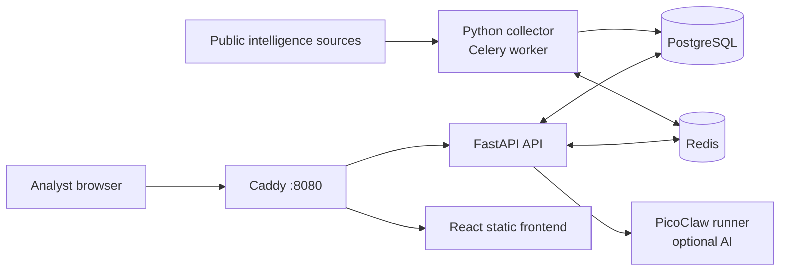

# ThreatLens

<p align="center">
  
</p>

<p align="center">
  Open-source, on-premises threat intelligence for collecting, investigating,
  and operationalizing public security data.
</p>

## Overview

ThreatLens combines vulnerability intelligence, indicators of compromise,
threat news, asset inventory, and optional AI-assisted investigation in one
self-hosted workspace. It is intended for home labs and security teams that
want to retain control of their intelligence data and infrastructure.

The production deployment is Podman-first and tested on Rocky Linux 9. Caddy is
the only public entrypoint. PostgreSQL, Redis, FastAPI, Celery, and PicoClaw
remain on an internal Podman network.

## Project Status

ThreatLens is under active development. Authentication, collection, CVE
investigation, IOC export, asset CRUD, reports, and the optional PicoClaw
integration are functional.

Current boundaries:

- Per-user alert delivery supports Telegram and Discord. Telegram bot tokens
  and Discord webhooks are stored per user from the UI.
- Asset exposure is inferred from asset metadata matched against CVE/NVD
  affected products. ThreatLens does not actively scan hosts or prove that a
  vulnerable component is installed.
- Production starts with an empty intelligence database. Optional demo records
  are available only when `SEED_DEMO_DATA=true`; never enable them on an
  operational instance.
- Database schema is managed by Alembic migrations at startup. Existing
  pre-migration databases are stamped only when the full current schema is
  already present.

## Features

- Executive overview with vulnerability, IOC, threat feed, and asset metrics
- CVE search with on-demand NVD lookup for records not cached locally
- CVE investigation with CVSS, CPE/CWE, CISA KEV status, affected products,
  root cause, MITRE ATT&CK mapping, references, mitigation, and workarounds
- PDF export for an individual CVE investigation
- IOC intelligence for IP addresses, domains, URLs, and SHA-256 hashes
- Filtered IOC export to formatted Excel workbooks
- Threat news with an in-app article overview and original source link
- Asset inventory CRUD for both admin and standard users
- Conservative asset exposure matching against known CVEs
- Per-user Telegram/Discord alerts for news, CVEs, affected assets, and source
  health failures
- First-run administrator bootstrap and `admin`/`user` roles
- Admin user creation and protected account deletion
- Secure cookies, CSRF protection, Argon2 hashes, and login rate limiting
- Optional PicoClaw AI workspace and AI-assisted CVE enrichment
- Automated hourly collection with Celery Beat

## Architecture



| Component | Runtime | Exposure | Responsibility |
| --- | --- | --- | --- |
| Caddy | `caddy:2-alpine` | Host port `8080` | Static frontend and `/api/*` reverse proxy |
| Frontend | React + Vite | Served by Caddy | Analyst and administration interface |
| API | FastAPI + Uvicorn | Internal `8000` | Authentication, data access, exports, enrichment |
| Worker | Celery worker | Internal only | Intelligence collection tasks |
| Beat | Celery Beat | Internal only | Hourly collection scheduling |
| PostgreSQL | PostgreSQL 16 | Internal `5432` | Application and intelligence data |
| Redis | Redis 7 | Internal `6379` | Celery broker and result backend |
| PicoClaw runner | PicoClaw sidecar | Internal `8090` | Optional isolated AI execution |

## Intelligence Sources

| Source | Data | Credential |
| --- | --- | --- |
| [NVD CVE API](https://nvd.nist.gov/developers/vulnerabilities) | CVE, CVSS, CPE, CWE, references | Optional API key |
| [CISA KEV](https://www.cisa.gov/known-exploited-vulnerabilities-catalog) | Known exploited vulnerabilities | None |
| [CVE.org](https://www.cve.org/) and vendor references | Product and remediation enrichment | None |
| [Feodo Tracker](https://feodotracker.abuse.ch/blocklist/) | Active botnet C2 IP addresses | None |
| [AlienVault Reputation](https://reputation.alienvault.com/) | Malicious IP reputation | None |
| [OpenPhish Community Feed](https://www.openphish.com/phishing_feeds.html) | Phishing URLs | None |
| [MalwareBazaar](https://bazaar.abuse.ch/) | Recent malware SHA-256 hashes | None |
| [URLhaus](https://urlhaus.abuse.ch/api/) | Malware URLs | Auth key required |
| [PhishDestroy](https://api.destroy.tools/v1/feed/primary_active) | Phishing domains | None |
| [The Hacker News](https://thehackernews.com/) | Threat news RSS | None |
| [BleepingComputer](https://www.bleepingcomputer.com/) | Threat news RSS | None |
| [SecurityWeek](https://www.securityweek.com/) | Enterprise security news RSS | None |
| [Krebs on Security](https://krebsonsecurity.com/) | Cybercrime investigation RSS | None |
| [SANS Internet Storm Center](https://isc.sans.edu/) | Technical threat diary RSS | None |
| [Google Security Blog](https://security.googleblog.com/) | Security research RSS | None |

External feeds can be temporarily unavailable or rate limited. A collection run
is recorded as `partial` when one source fails while the other sources continue
to update.

## Security Model

- The first account is created through a one-time bootstrap screen and always
  receives the `admin` role.
- Passwords require at least 15 characters, one uppercase letter, one lowercase
  letter, and one special character.
- Passwords use the recommended Argon2 password hash.
- Authentication uses an HTTP-only, `SameSite=Strict` session cookie.
- State-changing requests require a session-specific CSRF token.
- Login is limited to five failures per client within five minutes.
- Standard users can investigate intelligence and manage assets.
- Only admins can manage users and trigger a collection run.
- API documentation (`/api/docs`) and the OpenAPI schema
  (`/api/openapi.json`) require an authenticated admin session.
- An admin cannot delete their own account or the final remaining admin.
- PicoClaw has no host port, uses a read-only container filesystem, and runs
  with `no-new-privileges`.

For HTTPS deployments, terminate TLS in Caddy and set
`AUTH_COOKIE_SECURE=true`.

## Requirements

### Production

- Rocky Linux 9 or another recent RHEL-compatible distribution
- Root or sudo access
- Podman 4 or newer
- Git and OpenSSL
- 4 CPU cores, 8 GB RAM, and 20 GB storage recommended
- Outbound HTTPS access to public intelligence feeds
- TCP port `8080` reachable by intended users

### Local Development

- Podman or Docker with Compose support
- Node.js 22 when running the frontend outside a container
- Python 3.12 when running the backend outside a container

## Rocky Linux Installation

### 1. Install Host Dependencies

```bash
sudo dnf install -y podman git openssl
```

### 2. Place ThreatLens in `/opt/threatlens`

```bash
sudo git clone <repository-url> /opt/threatlens
cd /opt/threatlens
sudo chmod +x podman/threatlens-up.sh podman/threatlens-down.sh
```

Replace `<repository-url>` with the Git URL for your ThreatLens repository. The
production scripts currently expect the project at `/opt/threatlens`.

### 3. Configure the Environment

On a new production installation, `podman/threatlens-up.sh` creates
`/opt/threatlens/.env` automatically with random PostgreSQL and PicoClaw runner
secrets. Start the service once, then add optional settings as needed.

To configure all values before startup:

```bash
cd /opt/threatlens
sudo cp .env.example .env
sudo chmod 600 .env
sudo vi .env
```

Never deploy the example password or runner token unchanged. Keep
`DATABASE_URL` synchronized with `POSTGRES_PASSWORD`.

### 4. Install the Systemd Unit

```bash
sudo cp infra/systemd/threatlens.service /etc/systemd/system/threatlens.service
sudo systemctl daemon-reload
sudo systemctl enable --now threatlens.service
```

The first build downloads container images and dependencies and can take
several minutes.

### 5. Create the Initial Administrator

Open:

```text
http://<server-address>:8080
```

When no users exist, ThreatLens shows the one-time administrator setup page.
Create the first admin there and then sign in. The bootstrap endpoint is
disabled after the first account is created.

## Environment Variables

| Variable | Default | Purpose |
| --- | --- | --- |
| `POSTGRES_DB` | `threatlens` | PostgreSQL database |
| `POSTGRES_USER` | `threatlens` | PostgreSQL role |
| `POSTGRES_PASSWORD` | none | PostgreSQL password |
| `DATABASE_URL` | generated | SQLAlchemy PostgreSQL connection URL |
| `REDIS_URL` | internal Redis URL | Celery broker and result backend |
| `API_CORS_ORIGINS` | local addresses | Comma-separated browser origins |
| `NVD_API_KEY` | empty | Optional NVD API key for higher rate limits |
| `URLHAUS_AUTH_KEY` | empty | Enables authenticated URLhaus collection |
| `COLLECTOR_WINDOW_DAYS` | `2` | Recent NVD window, capped at 120 days |
| `NEWS_RETENTION_DAYS` | `180` | Delete threat news older than this after collection; `0` disables |
| `IOC_RETENTION_DAYS` | `180` | Delete IOCs not seen for this many days after collection; `0` disables |
| `COLLECTION_RUN_RETENTION_DAYS` | `30` | Delete old collection run records after collection; `0` disables |
| `COLLECTION_RUN_MIN_KEEP` | `10` | Always keep at least this many newest collection runs |
| `SEED_DEMO_DATA` | `false` | Development-only demo dataset |
| `AUTH_COOKIE_NAME` | `threatlens_session` | Session cookie name |
| `AUTH_COOKIE_SECURE` | `false` | Restrict session cookies to HTTPS |
| `AUTH_SESSION_HOURS` | `12` | Session lifetime |
| `AI_ENABLED` | `false` | Enables PicoClaw-backed features |
| `AI_PROVIDER` | empty | Provider configured in PicoClaw |
| `AI_MODEL` | empty | Model configured in PicoClaw |
| `PICOCLAW_RUNNER_TOKEN` | generated | API-to-runner shared secret |
| `PICOCLAW_RUN_TIMEOUT` | `180` | Runner process timeout |
| `PICOCLAW_TIMEOUT_SECONDS` | `180` | API request timeout for PicoClaw |
| `AI_MAX_PROMPT_CHARS` | `12000` | Maximum context sent to PicoClaw |

Apply environment changes with:

```bash
sudo systemctl restart threatlens.service
```

## PicoClaw AI Setup

AI is disabled by default. Deterministic CVE and IOC investigation remains
available without it.

ThreatLens sends public CVE context to PicoClaw and intentionally excludes
private asset inventory and credentials from AI prompts. AI output is stored
separately from authoritative NVD and CISA data and must be treated as inferred
analysis.

After the stack has been built, onboard a model provider into the persistent
PicoClaw volume:

```bash
sudo podman run --rm -it \
  -v threatlens-picoclaw-data:/data:Z \
  -e PICOCLAW_HOME=/data \
  -e PICOCLAW_CONFIG=/data/config.json \
  threatlens-picoclaw-runner:0.2.9 \
  picoclaw onboard
```

Update `/opt/threatlens/.env`:

```dotenv
AI_ENABLED=true
AI_PROVIDER=<provider-name>
AI_MODEL=<model-name>
```

Then restart the service:

```bash
sudo systemctl restart threatlens.service
```

Provider credentials belong in PicoClaw's protected data volume. Do not commit
provider keys, put them in frontend source, or send them in support messages.

## Operations

### Status

```bash
sudo systemctl status threatlens.service
sudo podman ps
```

### Logs

```bash
sudo journalctl -u threatlens.service -n 200 --no-pager
sudo podman logs --tail 200 threatlens-api
sudo podman logs --tail 200 threatlens-worker
sudo podman logs --tail 200 threatlens-beat
sudo podman logs --tail 200 threatlens-caddy
```

### Restart or Stop

```bash
sudo systemctl restart threatlens.service
sudo systemctl stop threatlens.service
```

### Deploy an Update

```bash
cd /opt/threatlens
sudo git pull --ff-only
sudo systemctl restart threatlens.service
```

Restarting rebuilds the API, PicoClaw runner, and frontend before recreating
the containers. PostgreSQL, Redis, Caddy, and PicoClaw data remain in named
Podman volumes.

### Database Migrations

The API runs `alembic upgrade head` on startup. For a database created before
Alembic was added, startup stamps the existing schema as the initial revision
only if all expected application tables are present.

Check the current revision:

```bash
sudo podman exec threatlens-api alembic current
```

Run migrations manually if needed:

```bash
sudo podman exec threatlens-api alembic upgrade head
```

### Run Maintenance Jobs

The full collector can be queued by an authenticated admin. Focused maintenance
jobs can also run directly:

```bash
sudo podman exec threatlens-api python -m app.scripts.backfill_iocs
sudo podman exec threatlens-api python -m app.scripts.backfill_products
```

Celery Beat schedules the full intelligence collection every hour.
After each collection, ThreatLens prunes expired news, stale IOCs, and old
collection run records according to the retention settings. Pruning counts are
stored in the latest collection run details.
Asset exposure matching is also recalculated after collection and whenever an
asset is created or updated. Users can manually recalculate exposure from the
Assets page.

### Health Check

```bash
curl http://127.0.0.1:8080/api/health
```

Expected response:

```json
{"status":"ok","service":"threatlens-api","checks":{"database":"ok","redis":"ok"}}
```

Protected endpoints correctly return `401 Unauthorized` without a valid
session.

## Backup and Restore

### Database Backup

```bash
sudo podman exec threatlens-postgres \
  pg_dump -U threatlens -d threatlens -Fc \
  > threatlens-$(date +%Y%m%d-%H%M).dump
```

Also back up `/opt/threatlens/.env` securely. When AI is enabled, include the
`threatlens-picoclaw-data` volume in the host backup policy.

### Database Restore

Restoring replaces application data. Stop application access and use a verified
backup:

```bash
sudo podman stop threatlens-api threatlens-worker threatlens-beat
sudo podman exec -i threatlens-postgres \
  pg_restore -U threatlens -d threatlens --clean --if-exists \
  < threatlens-backup.dump
sudo podman start threatlens-api threatlens-worker threatlens-beat
```

Test the restore process outside production before relying on it.

## Local Development

Docker Compose remains available as a local development convenience.
Production deployment is Podman-first.

```bash
cp .env.example .env
docker compose up --build
```

- Application: `http://localhost:8080`
- API health: `http://localhost:8080/api/health`
- OpenAPI documentation: `http://localhost:8080/api/docs` after admin login

Stop the local stack with:

```bash
docker compose down
```

## Testing

Run backend tests locally with the project virtual environment:

```bash
python -m venv .venv
.venv/bin/python -m pip install -r backend/requirements.txt
PYTHONPATH=backend .venv/bin/python -m unittest discover -s backend/tests -v
```

Run backend tests and the frontend build in the same container environment used
by production:

```bash
sh scripts/test-container.sh
```

Run dependency and filesystem security checks when `pip-audit`, `npm`, or
`trivy` are installed:

```bash
sh scripts/security-scan.sh
```

Backups support optional GPG encryption and rsync offsite copy without changing
the default local backup behavior:

```bash
BACKUP_ENCRYPTION_PASSPHRASE_FILE=/root/threatlens-backup.pass \
BACKUP_OFFSITE_RSYNC_TARGET=backup-host:/srv/threatlens \
sh podman/threatlens-backup.sh
```

## Project Structure

```text
threatlens/
|-- backend/
|   |-- app/                 FastAPI routes, models, schemas, services
|   |-- collector/           Intelligence collectors and parsers
|   |-- worker/              Celery tasks and schedule
|   |-- tests/               Backend tests
|   `-- Dockerfile
|-- frontend/
|   |-- public/brand/        Product artwork
|   |-- src/components/      React views and reusable UI
|   |-- src/lib/             API and authentication clients
|   `-- src/styles.css
|-- infra/
|   |-- caddy/Caddyfile      Static serving and reverse proxy
|   |-- postgres/init.sql    PostgreSQL initialization
|   `-- systemd/             Rocky Linux service unit
|-- picoclaw-runner/         Isolated PicoClaw HTTP sidecar
|-- podman/                  Production lifecycle scripts
|-- docker-compose.yml       Optional local development stack
|-- .env.example             Configuration reference
`-- LICENSE                  Apache License 2.0
```

## Troubleshooting

### Data Is Stale

Inspect worker logs and the latest collection status. One source failure does
not prevent other feeds from updating.

```bash
sudo podman logs --tail 300 threatlens-worker
```

### URLhaus Is Skipped

Set `URLHAUS_AUTH_KEY` in `.env`. Other IP, domain, URL, and hash feeds continue
to work without it.

### NVD Collection Is Slow

Set `NVD_API_KEY` for NVD's authenticated rate limit and restart the service.

### AI Is Unavailable

Confirm `AI_ENABLED`, `AI_PROVIDER`, and `AI_MODEL`, then verify PicoClaw
onboarding and logs:

```bash
sudo podman logs --tail 200 threatlens-picoclaw-runner
```

### Caddy Returns a Gateway Error

```bash
sudo podman ps
sudo podman logs --tail 200 threatlens-api
sudo podman logs --tail 200 threatlens-caddy
```

## Contributing

1. Create a focused branch.
2. Do not commit secrets, `.env`, generated data, or provider credentials.
3. Add or update tests for behavior changes.
4. Run the backend tests and frontend build.
5. Submit a pull request describing behavior, security impact, and validation.

Report security-sensitive findings privately to the maintainers instead of
opening a public issue.

## Data and Usage Notice

Threat intelligence may contain false positives, stale indicators, or
incomplete remediation guidance. Validate indicators and vendor advisories
before blocking infrastructure or changing production systems. ThreatLens does
not replace vendor support, incident response procedures, or professional
security review.

## License

ThreatLens is licensed under the [Apache License 2.0](LICENSE). Copyright 2026
ThreatLens contributors.
